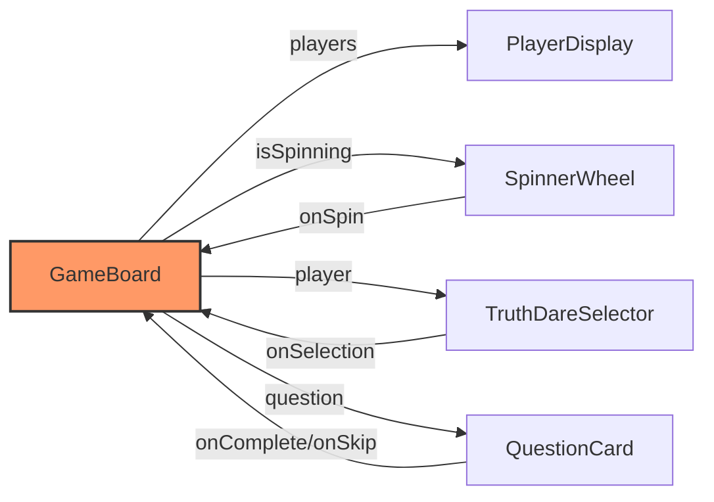

# 🎮 Truth or Dare Web Game

<div align="center">
  


**The ultimate party game for friends, couples, and family!**

[Live Demo](https://lovable.dev/projects/b87f15f8-35b1-4fe8-a189-4f4455829fed) | [Report Bug](https://github.com/yourusername/truth-or-dare/issues) | [Request Feature](https://github.com/yourusername/truth-or-dare/pulls)

</div>

---

## 📋 Table of Contents

- [Overview](#overview)
- [Features](#features)
- [Game Modes](#game-modes)
- [Tech Stack](#tech-stack)
- [Architecture](#architecture)
- [Installation](#installation)
- [Project Structure](#project-structure)
- [Components](#components)
- [Data Models](#data-models)
- [Development](#development)
- [Deployment](#deployment)
- [Contributing](#contributing)
- [License](#license)

---

## 🎯 Overview

Truth or Dare Web Game is a modern, interactive party game built with React and TypeScript. It features multiple game modes, voice output capabilities, animated spinning wheel, and score tracking. The game is designed to be responsive and works seamlessly across all devices.

### 🎥 Game Flow


---

## ✨ Features

### Core Features
| Feature | Description | Status |
|---------|-------------|--------|
| 🎡 **Spinning Wheel** | Animated wheel for random selection | ✅ Implemented |
| 🎤 **Voice Output** | Text-to-speech for questions and dares | ✅ Implemented |
| 👥 **Multi-player** | Support for 2-8 players | ✅ Implemented |
| 🏆 **Score Tracking** | Points system for completed/skipped challenges | ✅ Implemented |
| 🎨 **Custom Avatars** | Emoji-based player avatars | ✅ Implemented |
| 📱 **Responsive Design** | Works on all devices | ✅ Implemented |
| 🌈 **Gradient UI** | Modern gradient backgrounds and glassmorphism | ✅ Implemented |
| 🎮 **Multiple Modes** | 5 different game modes | ✅ Implemented |

### Game Statistics
| Metric | Value |
|--------|-------|
| Total Questions | 20+ |
| Game Modes | 5 |
| Max Players | 8 |
| Min Players | 2 |
| Points for Completion | +10 |
| Points for Skip | -5 |
| Age Ratings | PG, 13+, 18+ |

---

## 🎮 Game Modes

| Mode | Icon | Description | Players | Age Rating | Question Types |
|------|------|-------------|---------|------------|----------------|
| **Classic** | 👑 | The original truth or dare experience | 3+ | 13+ | General, Personal |
| **Couples** | ❤️ | Romantic questions and intimate dares | 2 | 13+ | Romantic, Intimate |
| **Friends** | 👥 | Party-focused fun for your squad | 3+ | 13+ | Social, Fun |
| **Family** | 👶 | Kid-friendly questions for all ages | 2+ | PG | Family-friendly |
| **Extreme** | ⚡ | Bold dares for the fearless | 3+ | 18+ | Challenging, Bold |

---

## 🛠️ Tech Stack

### Frontend
| Technology | Version | Purpose |
|------------|---------|---------|
| React | 18.3.1 | UI Framework |
| TypeScript | 5.5.3 | Type Safety |
| Vite | 5.4.1 | Build Tool |
| TailwindCSS | 3.4.11 | Styling |
| Shadcn/ui | Latest | UI Components |
| Lucide React | 0.462.0 | Icons |
| React Router | 6.26.2 | Routing |
| React Query | 5.56.2 | State Management |

### Development Tools
| Tool | Purpose |
|------|---------|
| ESLint | Code Linting |
| PostCSS | CSS Processing |
| Autoprefixer | CSS Vendor Prefixes |

---

## 🏗️ Architecture

### Component Architecture


### State Management Flow


---

## 📦 Installation

### Prerequisites
- Node.js 18+ 
- npm or yarn
- Git

### Setup Instructions

1. **Clone the repository**
```bash
git clone https://github.com/yourusername/truth-or-dare-game.git
cd truth-or-dare-game
```

2. **Install dependencies**
```bash
npm install
# or
yarn install
```

3. **Start development server**
```bash
npm run dev
# or
yarn dev
```

4. **Build for production**
```bash
npm run build
# or
yarn build
```

5. **Preview production build**
```bash
npm run preview
# or
yarn preview
```

---

## 📁 Project Structure

```
truth-or-dare-game/
├── 📂 public/
│   ├── placeholder.svg
│   └── robots.txt
├── 📂 src/
│   ├── 📂 components/
│   │   ├── GameBoard.tsx        # Main game board
│   │   ├── GameModeSelector.tsx # Mode selection cards
│   │   ├── PlayerDisplay.tsx    # Player status display
│   │   ├── PlayerSetup.tsx      # Player configuration
│   │   ├── QuestionCard.tsx     # Question/dare display
│   │   ├── SpinnerWheel.tsx     # Animated spinner
│   │   ├── TruthDareSelector.tsx # Truth/dare choice
│   │   └── 📂 ui/              # Shadcn UI components
│   ├── 📂 data/
│   │   └── questions.ts         # Game questions database
│   ├── 📂 hooks/
│   │   ├── use-mobile.tsx       # Mobile detection
│   │   └── use-toast.ts         # Toast notifications
│   ├── 📂 lib/
│   │   └── utils.ts             # Utility functions
│   ├── 📂 pages/
│   │   ├── Index.tsx            # Main page
│   │   └── NotFound.tsx         # 404 page
│   ├── 📂 types/
│   │   └── game.ts              # TypeScript definitions
│   ├── App.tsx                  # App root
│   ├── main.tsx                 # Entry point
│   └── index.css                # Global styles
├── .gitignore
├── package.json
├── tailwind.config.ts
├── tsconfig.json
└── vite.config.ts
```

---

## 🧩 Components

### Core Components

| Component | Purpose | Props | State Management |
|-----------|---------|-------|------------------|
| `GameBoard` | Main game controller | `mode`, `players`, `onBackToMenu` | Current player, question, game state |
| `GameModeSelector` | Mode selection UI | `onModeSelect` | None |
| `PlayerSetup` | Player configuration | `mode`, `onPlayersReady`, `onBack` | Players list |
| `PlayerDisplay` | Shows all players | `players`, `currentPlayerIndex` | None |
| `SpinnerWheel` | Animated wheel | `isSpinning`, `onSpin`, `disabled` | Rotation angle |
| `QuestionCard` | Question display | `question`, `player`, `onComplete`, `onSkip` | None |
| `TruthDareSelector` | Truth/Dare choice | `player`, `onSelection` | None |

### Component Communication



---

## 📊 Data Models

### TypeScript Interfaces

```typescript
// Player Model
interface Player {
  id: string;
  name: string;
  avatar: string;
  score: number;
}

// Question Model
interface Question {
  id: string;
  type: 'truth' | 'dare';
  text: string;
  category: string;
  difficulty: 'easy' | 'medium' | 'hard';
  ageRating: 'PG' | '13+' | '18+';
  mode: GameMode[];
}

// Game Settings
interface GameSettings {
  voiceEnabled: boolean;
  timerEnabled: boolean;
  timerDuration: number;
  passesAllowed: number;
  scoringEnabled: boolean;
}
```

### Question Categories

| Category | Description | Example |
|----------|-------------|---------|
| Personal | Individual experiences | "What's your biggest fear?" |
| Performance | Acting/performing tasks | "Do your best impression" |
| Social | Interaction with others | "Call a random contact" |
| Romantic | Couple-focused | "First impression of partner" |
| Family | Family-friendly | "Favorite family tradition" |
| Imagination | Creative thinking | "What superpower would you choose?" |

---

## 💻 Development

### Available Scripts

| Command | Description |
|---------|-------------|
| `npm run dev` | Start development server on port 8080 |
| `npm run build` | Build for production |
| `npm run build:dev` | Build in development mode |
| `npm run preview` | Preview production build |
| `npm run lint` | Run ESLint |

### Environment Setup

1. **Development Mode**
   - Hot Module Replacement (HMR) enabled
   - Source maps included
   - Component tagging for debugging

2. **Production Mode**
   - Optimized bundle size
   - Minified code
   - Tree shaking enabled

### Code Style Guidelines

- Use TypeScript for all new components
- Follow React Hooks best practices
- Implement proper error boundaries
- Use Tailwind CSS for styling
- Keep components small and focused
- Write meaningful commit messages

---

## 🚀 Deployment

### Deployment Options

| Platform | Configuration | Notes |
|----------|--------------|-------|
| **Lovable** | Automatic via Git | Primary deployment |
| **Vercel** | `vercel.json` config | Alternative option |
| **Netlify** | `netlify.toml` config | Static hosting |
| **GitHub Pages** | GitHub Actions | Free hosting |

### Build Configuration

```json
{
  "scripts": {
    "build": "vite build",
    "preview": "vite preview"
  }
}
```

### Performance Optimization

- Lazy loading for routes
- Code splitting by route
- Image optimization
- CSS purging in production
- Bundle size analysis

---

## 🤝 Contributing

We welcome contributions! Please follow these steps:

1. Fork the repository
2. Create a feature branch (`git checkout -b feature/AmazingFeature`)
3. Commit your changes (`git commit -m 'Add some AmazingFeature'`)
4. Push to the branch (`git push origin feature/AmazingFeature`)
5. Open a Pull Request

### Contribution Guidelines

- Write clear, descriptive commit messages
- Add tests for new features
- Update documentation as needed
- Follow the existing code style
- Ensure all tests pass before submitting PR

---

## 📝 License

This project is licensed under the MIT License - see the [LICENSE](LICENSE) file for details.

---

## 🙏 Acknowledgments

- [Shadcn/ui](https://ui.shadcn.com/) for the beautiful UI components
- [Lucide](https://lucide.dev/) for the icon library
- [TailwindCSS](https://tailwindcss.com/) for the utility-first CSS framework
- [Vite](https://vitejs.dev/) for the blazing fast build tool

---

## 📧 Contact

Project Link: [https://github.com/yourusername/truth-or-dare-game](https://github.com/yourusername/truth-or-dare-game)

---

<div align="center">
Made with ❤️ by Your Team
</div>
